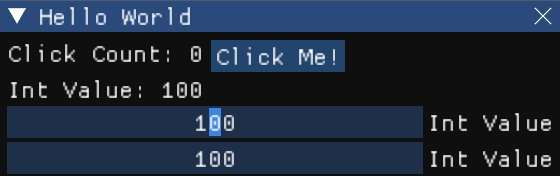

# imgui4cj

This project provides Cangjie programming language bindings for [Dear ImGui](https://github.com/ocornut/imgui), a bloat-free graphical user interface library for C++.

## Getting Started

### Installation

#### Option 1. Build from source

1. Prepare tools/dependencies
  * Install CMake, G++/CLANG/MSVC
  * Ensure you have `cjpm` installed
  * For Unix-like systems, follow the [GLFW compilation guide](https://www.glfw.org/docs/latest/compile.html) to install the necessary dependencies:
    * On Debian-based distributions (e.g., Ubuntu, Linux Mint): `sudo apt install libwayland-dev libxkbcommon-dev xorg-dev`
    * On Fedora-based distributions (e.g., Red Hat): `sudo dnf install wayland-devel libxkbcommon-devel libXcursor-devel libXi-devel libXinerama-devel libXrandr-devel`
    * On FreeBSD: `pkg install wayland libxkbcommon evdev-proto xorgproto`

2. Build `imgui4cj`
  ```shell
  git clone https://github.com/PGZXB/imgui4cj
  cd imgui4cj
  ./build_imgui4cj_c_lib.sh # use ".\build_imgui4cj_c_lib.ps1" on Windows
  cjpm build -V
  ```

3. Add package dependency to your `cjpm.toml`
  ```toml
  [dependencies]
    imgui4cj = { path = "/path/to/imgui4cj", version = "0.2.0"}

  # ...
  ```

#### Option 2. Download package with built C library

> [!NOTE]  
> Currently, this library provides releases only for Windows and Linux. We are working on making it available for macOS in the future.

1. Download & Extract
  * From releases:
    * [imgui4cj-windows-x86_64.zip](https://github.com/PGZXB/imgui4cj/releases/latest/download/imgui4cj-windows-x86_64.zip) for Windows
    * [imgui4cj-linux-x86_64.zip](https://github.com/PGZXB/imgui4cj/releases/latest/download/imgui4cj-linux-x86_64.zip) for Linux
  * From latest commit:
    * [imgui4cj-windows-x86_64.zip](https://nightly.link/PGZXB/imgui4cj/workflows/build-and-package/main/imgui4cj-windows-x86_64.zip) for Windows
    * [imgui4cj-linux-x86_64.zip](https://nightly.link/PGZXB/imgui4cj/workflows/build-and-package/main/imgui4cj-linux-x86_64.zip) for Linux
    * [imgui4cj-darwin-x86_64.zip](https://nightly.link/PGZXB/imgui4cj/workflows/build-and-package/main/imgui4cj-darwin-x86_64.zip) for macOS

2. Add package dependency to your `cjpm.toml`
  ```toml
  [dependencies]
    imgui4cj = { path = "/path/to/imgui4cj", version = "0.2.0"}

  # ...
  ```

### Run "Hello, world!"

Here is a simple example of how to create a basic window with some basic widgets:

```cangjie
import imgui4cj.*

main(): Int64 {
    let pOpen: Ref<Bool> = bool(true)
    let clickCount: Ref<Int64> = i64(0)
    let value: Ref<Int32> = i32(100)

    getBackend(GLFWOpenGL3).createWindow("Window", 800, 600).run {
        if (pOpen.value) {
            Begin("Hello World", pOpen, ImGuiWindowFlags_AlwaysAutoResize)

            Text("Click Count: ${clickCount}")
            SameLine(0.0, -1.0)
            if (Button("Click Me!", ImVec2(0.0, 0.0))) {
                clickCount.value += 1
            }

            Text("Int Value: ${value}")
            SliderInt("Int Value", value, 0, 200, "%d", 0)
            DragInt("Int Value", value, 1.0, 0, 200, "%d", 0)

            End()
        }
    }

    return 0
}
```



> [!NOTE]  
> For more detailed examples and usage patterns, please refer to the [examples directory](./examples/) in the repository.

### Usage Guidance

#### Global Functions

Global functions in `Dear ImGui` can be accessed through `imgui4cj.globalFunctionName`. The function names are consistent with those in `Dear ImGui`. 

The conversion rules for parameter types are:
* **Basic types** (`bool`, `int`, `float`, ...): Correspond to Cangjie’s basic types (`Bool`, `Int`, `Float32`, ...).
* **String types** (`const char *`, `char *`): Types implementing the `CStringConvertable` interface. `imgui4cj` provides implementations for `String`, `CString`, `CPointer<UInt8>`, and `Ref<UInt8>`.
* **Function types** (callbacks): Correspond to Cangjie’s `CFunc` type. Future versions may support passing Cangjie functions and closures.
* **Array types** (`T [N]`): Treated similarly to single-level pointer types (`T *`).
* **Struct types** (`ImVec2`, ...): Represented by `class imgui4cj.StructName`, with names consistent with `Dear ImGui`. These classes serve as wrappers for the corresponding `Dear ImGui` structs, allowing for instance creation with constructors matching those in `Dear ImGui`, accessing and modifying member variables, and calling static and member functions.
* **Pointer types** (`int *`, `ImVec2 *`, ...): Based on the pointed-to type:
  * **Basic types**: `Ref<BasicType>`, a wrapper for `CPointer`, providing helper functions for representing pointers or one-dimensional arrays.
  * **String types**: `Ref<CPointer<UInt8>>`.
  * **Function types**: `Ref<CFunc<...>>`.
  * **Array types**: Treated similarly to double-level pointer types.
  * **Struct types**: `class imgui4cj.StructName`.
* The `...` are removed from parameter list.

The return type conversion rules are:
* **Basic types**: Correspond to Cangjie’s basic types (`Bool`, `Int`, `Float32`, ...).
* **String types**: Correspond to Cangjie’s `String` type.
* **Function types**: Correspond to Cangjie’s `CFunc` type.
* **Array types**: Treated similarly to single-level pointer return types (`T *`).
* **Struct types**: `class imgui4cj.StructName`, as weak references.
* **Pointer types**: Based on the pointed-to type, acting as weak references.

Most functions are supported except those with parameters of type `va_list`. For detailed information, see [docs/imgui_global_functions.md](./docs/imgui_global_functions.md).

#### Structs

Structs in `Dear ImGui` are represented by `class imgui4cj.StructName`, with names consistent with `Dear ImGui` (except for template-instantiated structs).
* **Constructors**: Consistent with `Dear ImGui`, with the same parameter conversion rules as global functions.
* **Member variables**: Each member variable is implemented as a `mut prop`, with names and types consistent with `Dear ImGui`:
  * **Basic types**: Correspond to Cangjie’s basic types.
  * **String types**: Correspond to Cangjie’s `String` type.
  * **Function types**: Correspond to Cangjie’s `CFunc` type.
  * **Array types**: Treated similarly to single-level pointer types.
  * **Struct types**: `class imgui4cj.StructName`.
  * **Pointer types**:
    * **Basic types**: `Ref<BasicType>`, a wrapper for `CPointer`, providing helper functions for representing pointers or one-dimensional arrays.
    * **String types**: `Ref<CPointer<UInt8>>`, as weak references.
    * **Function types**: `Ref<CFunc<...>>`, as weak references.
    * **Array types**: Treated similarly to double-level pointer types.
    * **Struct types**: `class imgui4cj.StructName`, as weak references.
  * Arrays cannot be reassigned but their elements can be modified through `Ref`.
* **Static and member functions**:
  * **Function names**: Consistent with `Dear ImGui`.
  * Parameter and return type conversion rules are consistent with global functions.

Most structs are supported, except those with union or bitfield member variables. For template-instantiated structs, only member variable access are supported. For detailed information, see [docs/imgui_structs.md](./docs/imgui_structs.md).

#### Enums

Enum items in `Dear ImGui` are accessed through `imgui4cj.EnumItem`.
* Enum items are of type `Int32`.
* Enum item names are consistent with those in `Dear ImGui`.

#### Backend Support

Currently, `imgui4cj` supports the [`GLFW+OpenGL3`](./src/backends/glfw_opengl3_backend.cj) backend. Additional backend support is planned! Backends are created using `imgui4cj.getBackend` and used through the `imgui4cj.Backend` interface. For detailed information, see [docs/backends.md](./docs/backends.md).

## Contributing

We welcome contributions to `imgui4cj`! If you have suggestions, bug reports, or would like to contribute code, please follow these steps:

1. Fork the repository.
2. Create a new branch for your feature or fix.
3. Submit a pull request with a clear description of your changes.

For bug reports or feature requests, please open an issue on the [GitHub issues page](https://github.com/PGZXB/imgui4cj/issues).

## Development Status

This library is currently under active development. As Cangjie's syntax and API continue to evolve, breaking changes may occur. However, once Cangjie reaches a stable release, we will strive to maintain backward compatibility. Please report any issues you encounter and consider contributing to the project. Your feedback is invaluable in helping us improve `imgui4cj`.
